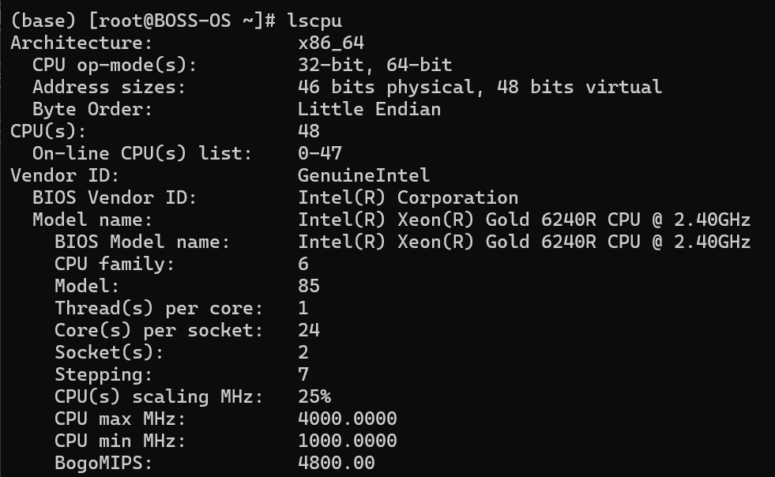
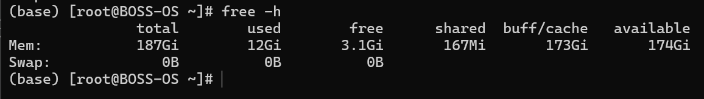
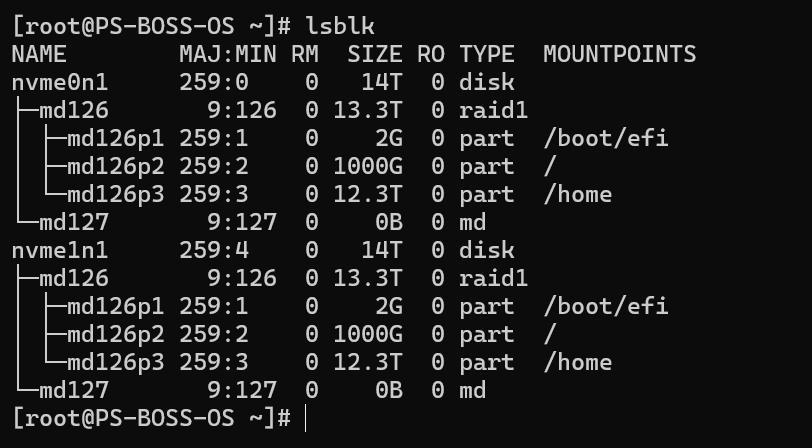
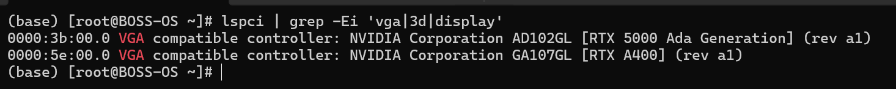
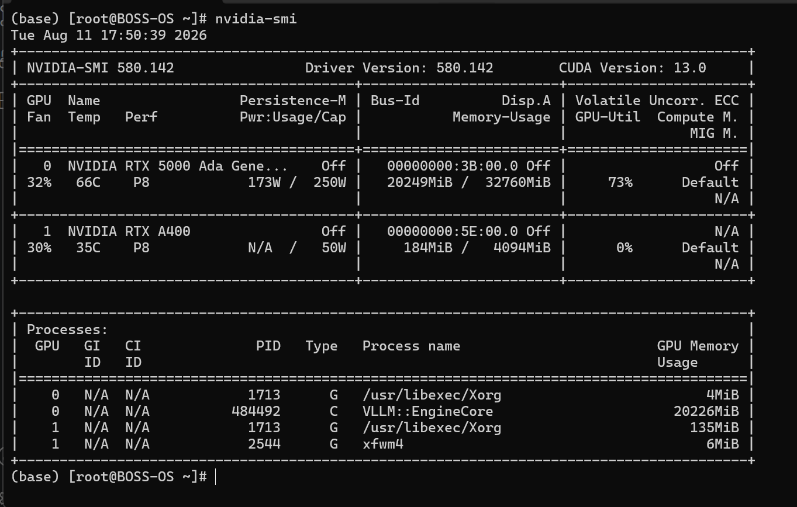

# Linux Hardware Component Check

This section provides a procedure for system administrators to verify the hardware components installed and detected by a Linux system.

The purpose of this check is to confirm that the expected hardware components are detected correctly by the operating system.

---

## Check CPU

The CPU check verifies that the processor is detected correctly and provides information about the installed processor.

### Tool

`lscpu`

### Steps

1. Open a terminal.
2. Run the following command:

```
lscpu
```

3. Review the CPU information displayed.
4. Verify the following details:
    - CPU architecture
    - CPU model
    - CPU vendor
    - Number of CPUs
    - Number of cores
    - Number of threads

**Screenshot:**


### Expected Result

The CPU should be detected and the displayed model and core/thread information should match the expected system hardware.

---
## Check RAM

The RAM check verifies the amount of memory detected by the operating system.

### Tool

`free`

### Steps

1. Open a terminal.
2. Run:

```
free -h
```

3. Review the **Mem** section.
4. Check the **total** memory value.

**Screenshot:**


### Expected Result

The total RAM reported by Linux should match the expected physical memory installed in the system.

> **Note:** The `free -h` command is used here only to verify the amount of RAM detected. Memory utilization and performance monitoring are outside the scope of this document.

---
## Check Disk / Storage

The storage check verifies that the expected physical storage devices are detected by the operating system.

### Tool

`lsblk`

### Steps

1. Open a terminal.
2. Run:

```
lsblk
```

For additional filesystem information:

```
lsblk -f
```

3. Review the list of storage devices.
4. Verify the expected disk or storage devices are present.
5. Check the reported device sizes.

**Screenshot:**


### Expected Result

The expected storage devices should be detected and their reported sizes should correspond to the installed hardware.

---
## Check GPU

The GPU check verifies that the graphics hardware is detected by Linux.

### Tool

`lspci`

### Steps

1. Open a terminal.
2. Run:

```
lspci | grep -Ei 'vga|3d|display'
```

3. Review the output.
4. Identify the GPU manufacturer and model.

**Screenshot:**


### Expected Result

The installed GPU should be listed by the operating system.

---
## Check NVIDIA GPU

For systems equipped with an NVIDIA GPU, `nvidia-smi` can be used when the appropriate NVIDIA driver is installed.

### Tool

`nvidia-smi`

### Steps

1. Open a terminal.
2. Run:

```
nvidia-smi
```

3. Verify that the GPU is detected.
4. Check the displayed GPU model.
5. Check the driver information.

**Screenshot:**


### Expected Result

The NVIDIA GPU should be detected and the correct GPU model should be displayed.

> **Note:** `nvidia-smi` is specific to NVIDIA GPUs and requires a supported NVIDIA driver.

---
!!! note "Note" 
A component not appearing in a command's output does not always indicate physical hardware failure. Verify the system configuration, drivers, BIOS/UEFI settings, and applicable hardware documentation before concluding that a component is faulty.