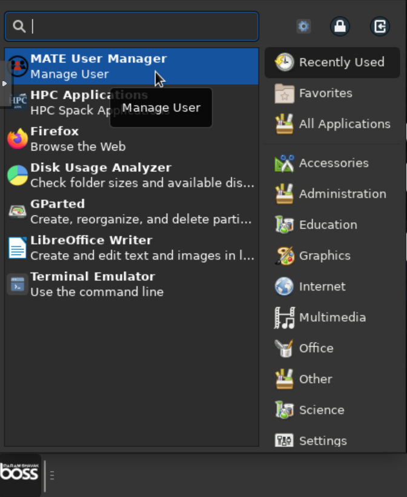
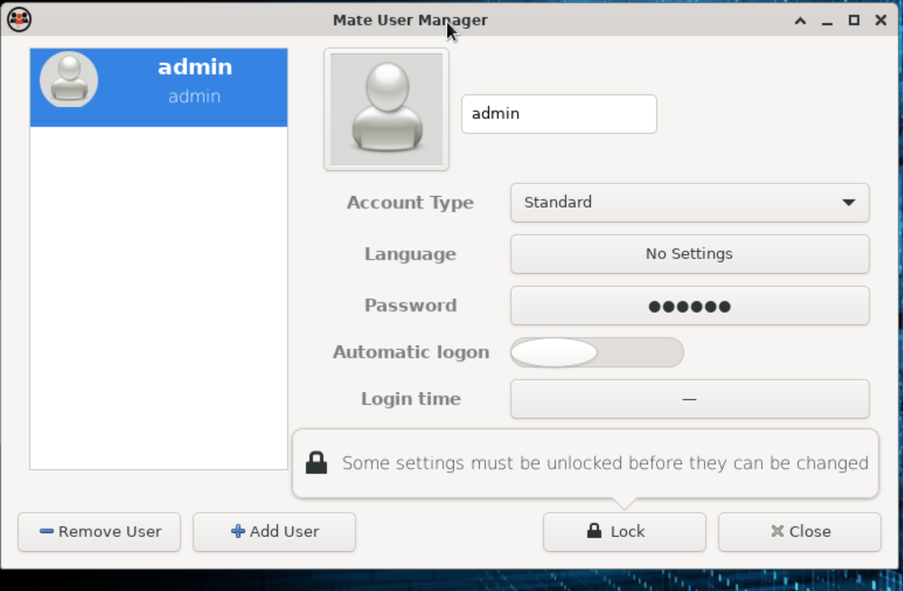
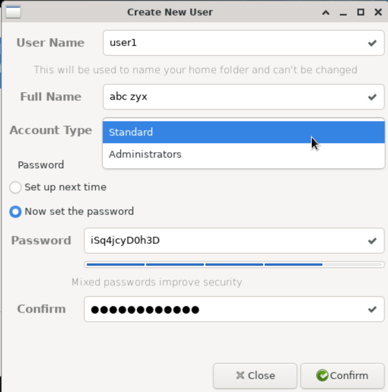
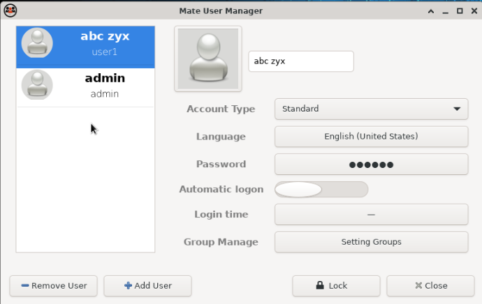

# User Management Using MATE User Manager

## Overview

**MATE User Manager (`mate-user-manager`)** is a graphical tool used to create and manage local user accounts.

This guide explains how to create a user using the available fields in MATE User Manager.

The user creation form contains the following fields:

- **Username**

- **Full Name**

- **Account Type**

- **Password**


---

## Launch MATE User Manager

Launch **MATE User Manager** from the system application menu.

Alternatively, open a terminal and run:

```bash
mate-user-manager
```

If prompted, provide the required administrator credentials.






---

## Create a New User

To create a new user:

1. Open **MATE User Manager**.

2. Select the option to **Add** or **Create** a user.

3. Enter the required user information.

4. Select the appropriate account type.

5. Enter and confirm the password.

6. Review the information.

7. Save or create the user.






---

## User Parameters

The user creation screen contains the following parameters.

|Parameter|Example|Description|
|---|---|---|
|**Username**|`shavak`|Unique name used to identify the user account.|
|**Full Name**|`Shavak Shavak`|Full name associated with the user account.|
|**Account Type**|`Standard User`|Determines the type of account and associated privileges.|
|**Password**|User-defined|Password used to authenticate the user.|

---

## Account Type

The **Account Type** determines the type of account being created.

Select the appropriate account type based on the user's responsibilities.

For this example:

```text
Standard User
```

Possible account types displayed by the system may vary depending on the Linux distribution and MATE User Manager configuration

### Standard User

A standard user should be used for normal day-to-day activities without unnecessary administrative privileges.

### Administrator

If an administrator account is available, use it only when the user requires administrative privileges.

> **Security Recommendation:** Follow the principle of least privilege and assign administrator privileges only when required.

---

## Password

Enter a password for the user account.

For security, the password should comply with the configured system password policy.

### Password Requirements

The password should:

- Contain at least **8 characters**.

- Include uppercase characters.

- Include lowercase characters.

- Include numbers.

- Include special characters.


> **Note:** The actual password requirements may be enforced by the system's password policy. Follow the password requirements displayed by the application.

---

## Groups

Groups are used to organize users and manage access to system resources.

If the version of MATE User Manager being used provides group management, groups can be managed separately from the basic user creation form.

For example:

```text
developers
engineering
project-team
```

The `shavak` user can be assigned to the required groups according to the organization's access requirements.

> **Note:** If group assignment is not available in the user creation screen, group membership must be configured using the available group-management interface or another supported system administration method.

---

