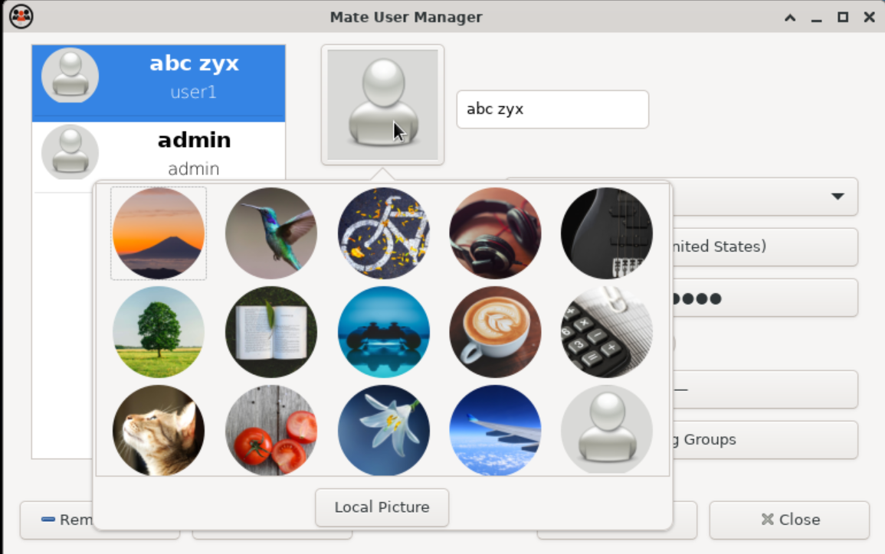
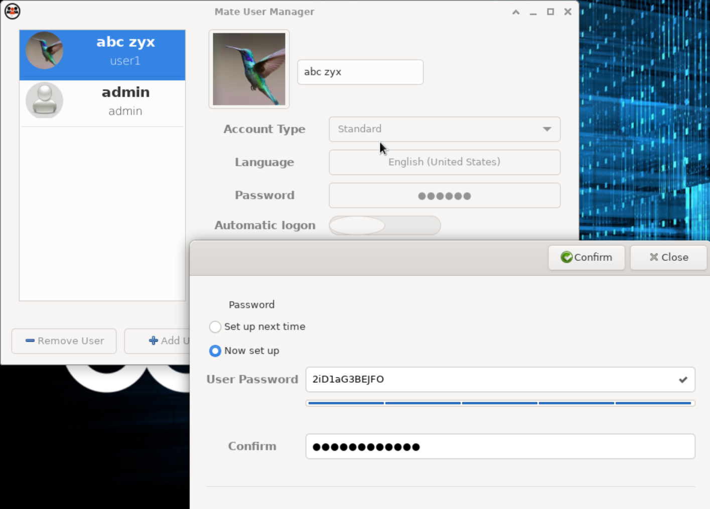
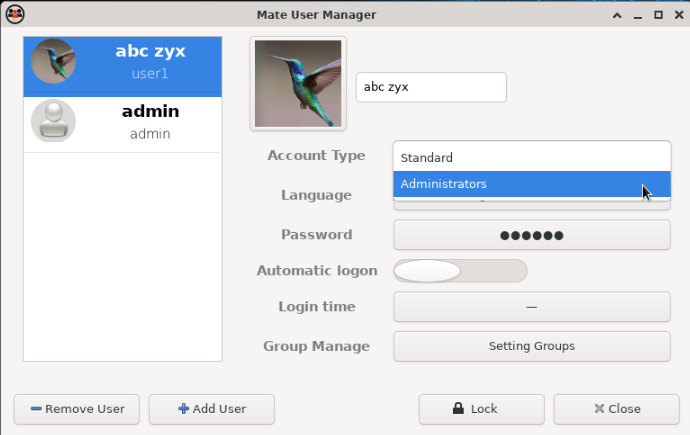
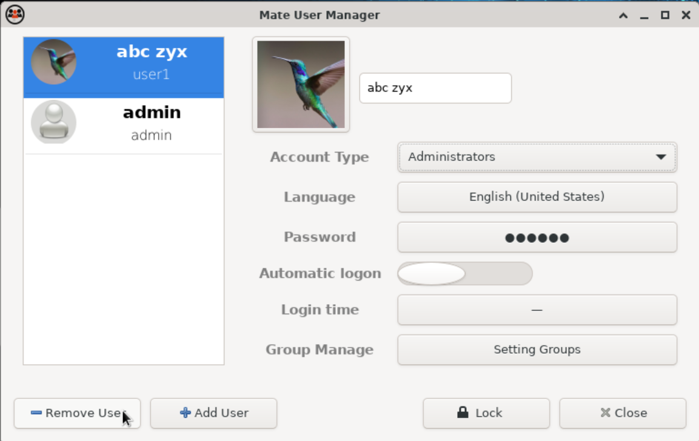
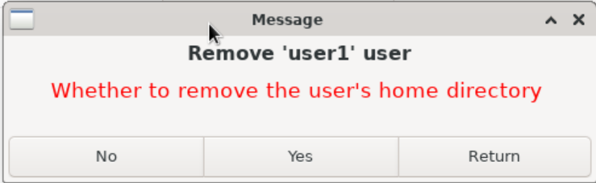
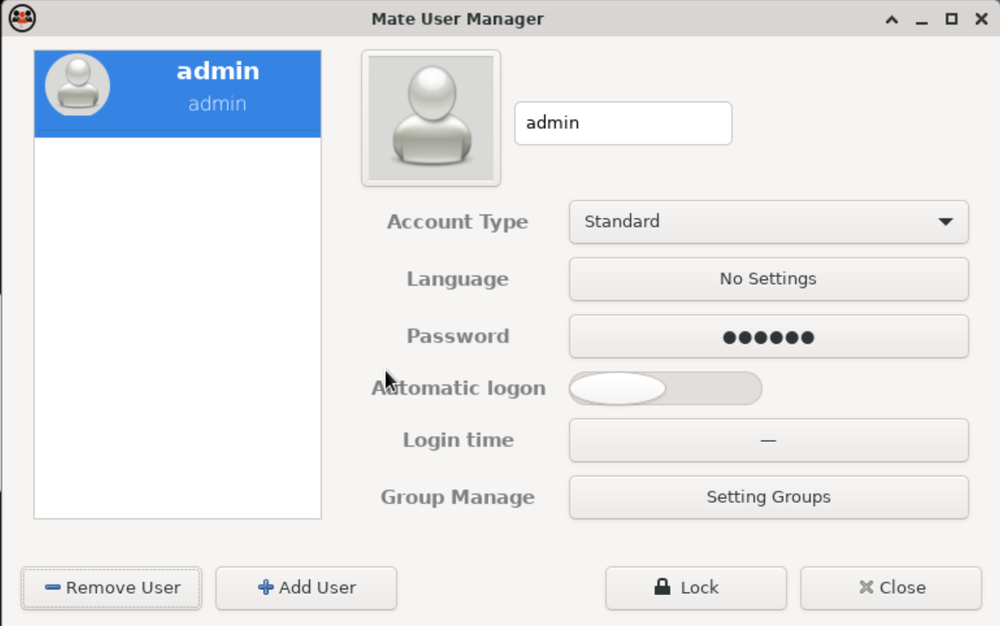

## User Management - GUI
This section provides instructions for system administrators to manage existing Linux user accounts using the graphical **User Manager** available in the MATE/Xfce desktop environment.

---

## Update User Profile Picture

The profile picture can be changed to provide a visual identification for the user account.

### Steps

1. In **MATE User Manager**, select the user whose profile picture you want to change.
2. Open the user's **Properties** or **Edit** window.
3. Locate the current **profile picture** or user image.
4. Click the profile picture or image-selection button.
5. Select the option to **Change**, **Select**, or **Browse** for a new picture.
6. Browse to the location of the required image.
7. Select the image.
8. Confirm the selected image.
9. Click **Apply** or **OK** to save the change.

**Screenshot 1:**

**Screenshot 2:**

---

## Change User Password

Use the password settings to change the password of an existing user.

### Steps

1. In **MATE User Manager**, select the required user.
2. Open the user's **Properties** or **Edit** window.
3. Locate the **Password** option.
4. Select the option to change the password.
5. Enter the new password.
6. Confirm the new password.
7. Click **Apply** or **OK** to save the change.
8. Enter administrator credentials if prompted.

**Screenshot:**

 
### Verification

Verify that the password change was successfully applied by using the approved authentication method.

> **Security Note:** The new password must comply with the organization's password policy. Never document or share the user's password.

---
## Change Account Type

The account type determines the level of access and administrative privileges available to the user.

Depending on the system configuration, available account types may include:

- **Standard User**
- **Administrator**

### Steps

1. In **MATE User Manager**, select the required user.
2. Open the user's **Properties** or **Edit** window.
3. Locate the **Account Type** setting.
4. Select the required account type.
5. Review the selected account type carefully.
6. Click **Apply** or **OK** to save the change.
7. Enter administrator credentials if prompted.

**Screenshot:**

### Administrator Account

An administrator account has elevated privileges and may be able to perform system-level administrative tasks.

Administrator access should only be assigned when required.

### Standard User Account

A standard user has limited privileges and generally cannot perform privileged system operations without additional authorization.

> **Security Note:** Follow the principle of least privilege. Assign administrator access only when it is required for the user's role.

---
## Delete User

Deleting a user account is a destructive operation. Verify that the account is no longer required before proceeding.

### Before Deleting the User

Before deleting the account:

- Confirm that the correct user has been selected.
- Obtain the required authorization.
- Back up or transfer required user data.
- Check whether the user owns important files.
- Confirm whether the user's home directory should also be removed.

### Steps

1. In **MATE User Manager**, select the user you want to delete.
2. Click **Delete**, **Remove User**, or the equivalent option.
3. Review the deletion confirmation dialog.
4. If prompted, select whether the user's home directory should also be deleted.
5. Confirm the deletion.
6. Enter administrator credentials if prompted.
7. Wait for the deletion operation to complete.

**Screenshot 1:**

**Screenshot 2:**

**Screenshot 3:**

> **Warning:** If the option to delete the user's home directory is selected, files stored in that directory may be permanently removed. Ensure that all required data has been backed up or transferred before confirming the deletion.