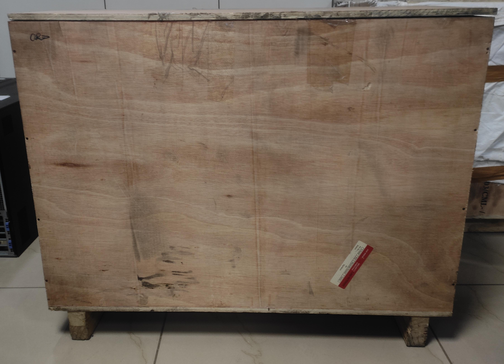
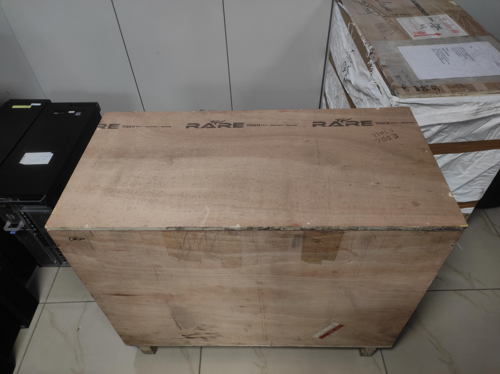
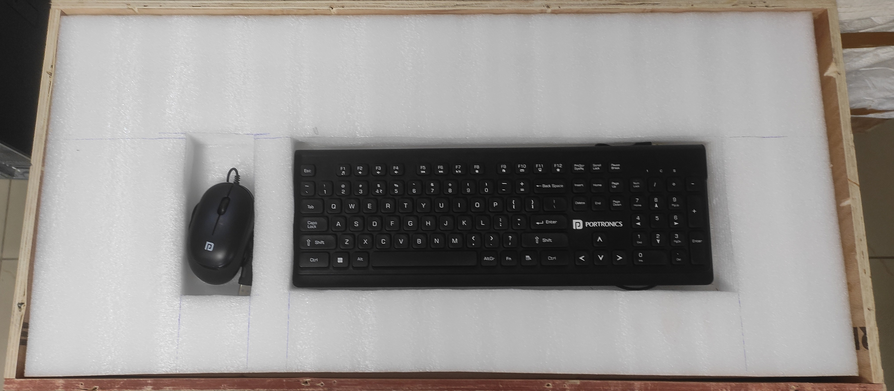
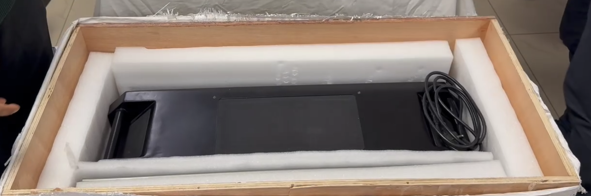
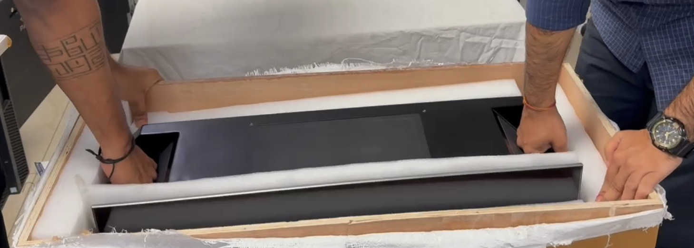

# Unboxing the All-in-One Server from the Wooden Crate

## Overview

The all-in-one server is securely packed inside a wooden crate for protection during transportation. The crate is designed to be opened from the **top**, and the upper protective foam contains dedicated compartments for the keyboard and mouse.

Follow the procedure below to safely open the crate, remove the protective packaging and accessories, and carefully remove the all-in-one server system.

!!! warning "Safety Precautions"  
- Perform the unboxing on a stable, level surface with sufficient working space.  
- The server system may be heavy. Use appropriate lifting equipment or assistance when required.  
- Wear appropriate safety equipment, including safety gloves and safety shoes.  
- Do not attempt to lift or move the server alone if its weight exceeds safe manual-handling limits.  
- Keep the area around the crate clear of obstacles.  
- Take extra care because the **monitor is permanently attached to the server board/system**.  
- Do not pull, lift, or apply pressure to the monitor while removing the server from the crate.  
- Do not use sharp tools near the monitor, cables, or server components.

## Required Tools

The following tools and equipment may be required:

- Screwdriver
- Safety gloves
- Safety shoes
- Lifting equipment, if required
- Assistance from another person when handling the server

---
## Unboxing Procedure

### 1. Inspect the Wooden Crate

Before opening the crate, visually inspect the packaging for any signs of transportation damage.

Check for:

- Broken or damaged wooden panels
- Cracks or holes in the crate
- Signs of water or moisture exposure
- Damaged corners or edges
- Loose or displaced packaging
- Any visible impact or transportation damage

!!! warning "Do Not Proceed if Severe Damage Is Found"  
If the crate or server appears to have suffered significant transportation damage, document the damage with photographs and notify the responsible administrator or supplier before proceeding.

### 2. Position the Crate

Place the wooden crate on a stable and level surface with sufficient clearance around it.

Ensure that:

- The crate is stable.
- There is enough space above the crate to safely remove the top section.
- There is sufficient working space around the crate.
- The path for removing the server is clear of obstacles.

### 3. Open the Top of the Wooden Crate

The wooden crate is designed to be opened from the **top**.

Carefully identify the screws securing the upper section of the crate.

- Remove the screws using the appropriate screwdriver.
- Remove all screws securing the top section before attempting to lift it.
- Carefully lift and remove the top wooden panel.
- Place the removed panel in a safe location where it will not create a trip or handling hazard.

!!! warning "Handle the Crate Carefully"  
Wooden panels may contain exposed screws, nails, or sharp edges. Wear appropriate protective equipment while opening and handling the crate.

### 4. Upper Protective Foam

After opening the top of the crate, locate the upper protective foam layer.

The upper foam contains dedicated compartments for the accessories.

Carefully lift the foam section out of the crate.

The foam compartments contain:

- Keyboard
- Mouse

Remove the keyboard and mouse from their respective compartments and place them safely aside.

!!! warning "Do Not Force the Foam"  
Lift the foam carefully. Do not use excessive force or pull against cables or components that may be secured underneath the foam.

### 5. Remove the Power Cable

After removing the upper foam, locate the **power cable** packed with the server system.

- Carefully remove the power cable.
- Inspect the cable for any visible damage.
- Place the power cable safely aside until the server is ready for installation.

### 6. Prepare and Carefully Remove the All-in-One Server

Before removing the server system, inspect the remaining protective packaging and identify any foam, supports, plastic wrapping, or other materials securing the system in place.

Ensure that:

- All removable packaging has been identified.
- The server has sufficient clearance for removal.
- The monitor is fully supported.
- No cables or accessories are caught on the crate or packaging.
- A second person is available to assist if required.

Carefully pull the server board/system out of the wooden crate while supporting it from its designated structural areas. Move the system slowly and evenly, ensuring that the attached monitor does not contact the wooden crate, foam, or surrounding objects.

If the system is heavy or difficult to remove:

- Stop the removal process.
- Obtain assistance from another person.
- Use suitable lifting equipment when required.
- Ensure the monitor remains protected and supported throughout the movement.

!!! warning "Protect the Attached Monitor"  
The monitor is attached to the server board/system. **Extreme care must be taken while pulling the server out of the crate.**

Do not:

- Pull the server by the monitor.
- Lift the system using the monitor as a handle.
- Apply pressure to the display panel.
- Allow the monitor to strike the wooden crate.
- Bend or twist the monitor assembly.
- Allow the monitor or attached components to catch on the foam or packaging materials.

### 7. Remove Remaining Protective Packaging

Once the server system is safely outside the crate, carefully remove any remaining protective materials.

Typical materials may include:

- Foam padding
- Plastic wrapping
- Corner protectors
- Protective covers
- Shock-absorbing material
- Internal supports

Remove these materials carefully without applying pressure to the monitor or server components.

### 8. Inspect the All-in-One Server

After removing the server from the crate, perform a physical inspection.

Check the following:

- Server board/system
- Attached monitor
- Monitor mounting points
- Front and rear panels
- Power connections
- Network ports
- USB ports
- Display ports
- Cooling vents and fans
- Internal or external expansion components
- Power cable
- Keyboard
- Mouse
- Other supplied accessories

Look for:

- Physical damage
- Dents or cracks
- Scratches
- Loose components
- Damaged connectors
- Damaged monitor or display panel
- Loose cables
- Missing accessories

!!! warning "Report Any Damage"  
If any damage is found on the server, monitor, accessories, or cables, do not power on the system. Document the damage with photographs and notify the responsible administrator or supplier.

### 9. Verify the Accessories

Compare the contents of the shipment with the supplied packing list.

Verify that all required items are present, including:

- All-in-one server system
- Attached monitor
- Keyboard
- Mouse
- Power cable
- Other accessories supplied with the system
- Documentation, if supplied

---
## Video Demo

!!! tip "Video Reference"  
For a complete visual demonstration of the unboxing procedure, **watch the video below for the full step-by-step unboxing process**. The video demonstrates the correct method for opening the wooden crate, removing the protective packaging, and safely taking out the all-in-one server system while protecting the attached monitor.

<video controls width="100%"> 
<source src="/image/unbx-vid.mp4" type="video/mp4"> 
</video>
