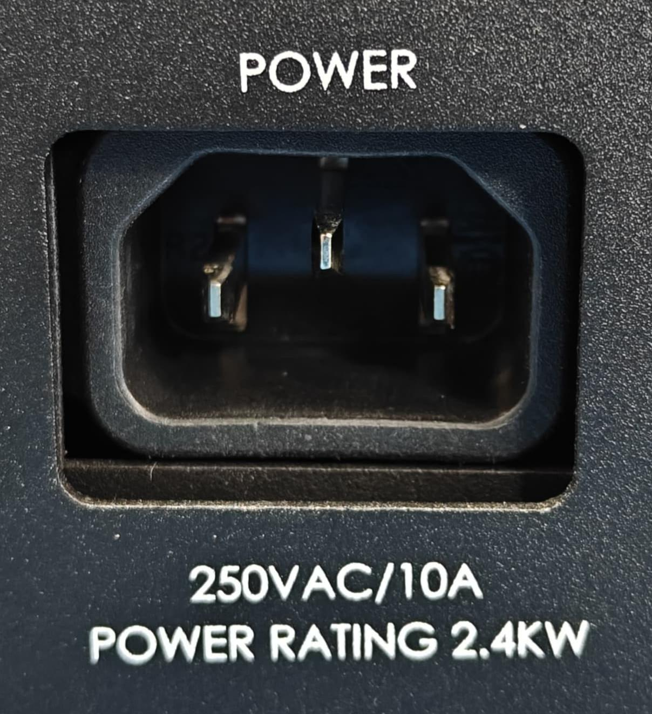
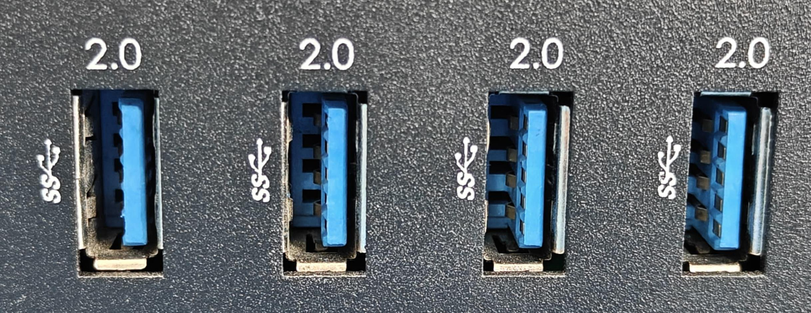
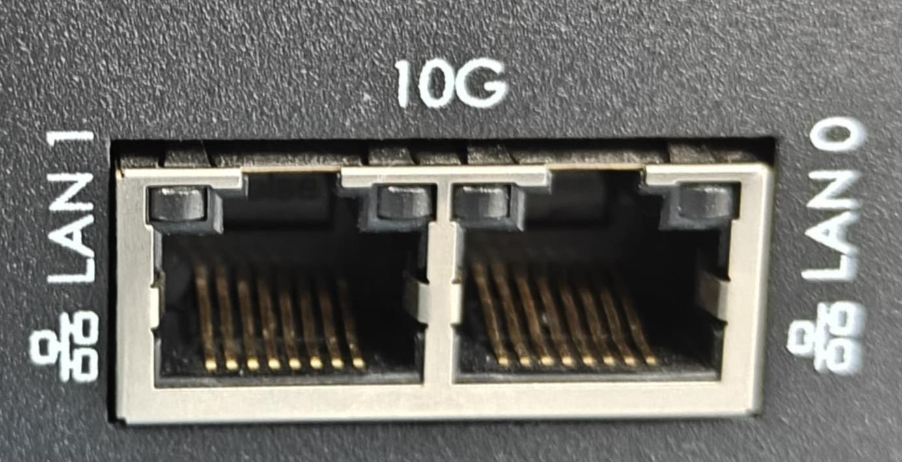
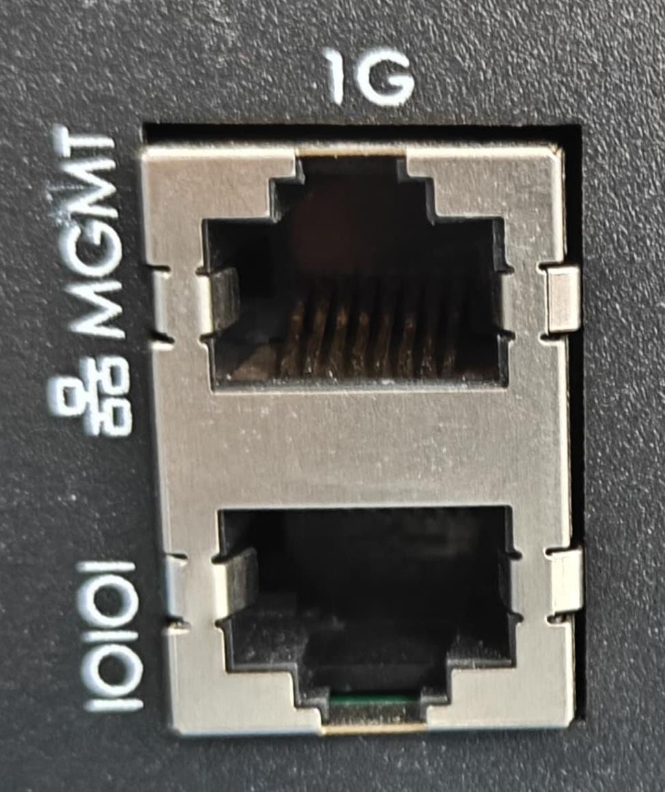
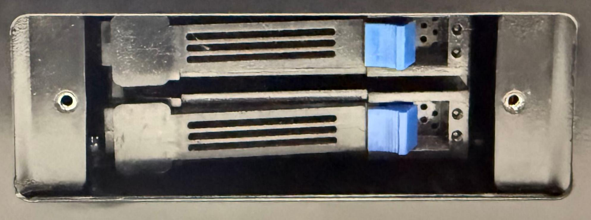

# Server Port Guide

This section provides an overview of the ports, connectors, and storage interfaces available on the server. It is intended to help users identify each interface and understand its primary purpose.

## Port Layout Overview

The server provides the following ports and interfaces:

| Port / Interface    | Quantity | Connector / Specification | Purpose                                                               |
| ------------------- | -------: | ------------------------- | --------------------------------------------------------------------- |
| Power Socket        |        1 | 3-pin, 10 A               | Connects the server to the AC power supply.                           |
| USB 2.0 Type-A      |        4 | USB Type-A                | Connects compatible USB peripherals.                                  |
| 10 GbE LAN          |        2 | Ethernet                  | Provides high-speed network connectivity.                             |
| BMC Management Port |        1 | Ethernet                  | Provides dedicated server management and monitoring.                  |
| Serial Console Port |        1 | Serial                    | Provides direct console access for configuration and troubleshooting. |
| U.2 NVMe SSD Slot   |        2 | U.2                       | Provides high-speed NVMe storage connectivity.                        |

---
## 1. Power Socket

The server is equipped with **one 3-pin, 10 A AC power socket**.

**Specifications:**

- Quantity: 1
- Connector: 3-pin
- Rated current: 10 A
- Function: AC power input

The power socket is used to connect the server to the AC power supply using the supplied power cable.

!!! warning "Power Connection"  
Ensure that the power source and power cable are suitable for the server's electrical requirements. Do not use damaged cables or unsuitable power sources.

## 2. USB 2.0 Type-A Ports

The server provides **four USB 2.0 Type-A ports** for connecting compatible USB peripherals.

Typical uses include:

- Keyboard
- Mouse
- USB storage devices
- Other compatible USB peripherals

## 3. 10 GbE LAN Ports

The server provides **two 10 Gigabit Ethernet (10 GbE) LAN ports** for high-speed network connectivity.

Typical uses include:

- Server network connectivity
- High-speed data transfer
- Server-to-server communication
- Network services

The actual network speed depends on the server configuration and connected network infrastructure.

## 4. BMC Management and Serial Console Ports

The server includes **one BMC management port and one serial console port**, which are **vertically paired** on the rear I/O panel.

- **BMC Management Port:** Used for server management, monitoring, and remote administration.

- **Serial Console Port:** Used for direct console access, configuration, and troubleshooting.

!!! tip "Port Identification"  
Refer to the labels on the rear I/O panel to identify the BMC management and serial console ports correctly.

## 5. U.2 NVMe SSD Slots

The server provides **two U.2 NVMe SSD slots** for high-speed storage.

**Specifications:**

- Quantity: 2
- Form factor: U.2
- Storage technology: NVMe SSD

The slots support compatible U.2 NVMe SSDs for high-performance storage applications.

!!! warning "U.2 SSD Compatibility"  
Only install U.2 NVMe SSDs that are compatible with the server's hardware and supported configuration.

## Port Identification Summary

|Interface|Quantity|Key Information|
|---|--:|---|
|Power Socket|1|3-pin, 10 A AC input|
|USB 2.0 Type-A|4|Peripheral connectivity|
|10 GbE LAN|2|High-speed network connectivity|
|BMC Management Port|1|Server management and monitoring|
|Serial Console Port|1|Console access and troubleshooting|
|U.2 NVMe SSD Slot|2|U.2 NVMe storage|

!!! success "Port Guide Complete"  
The server ports and interfaces have been identified. Refer to the relevant installation and configuration procedures for detailed instructions.