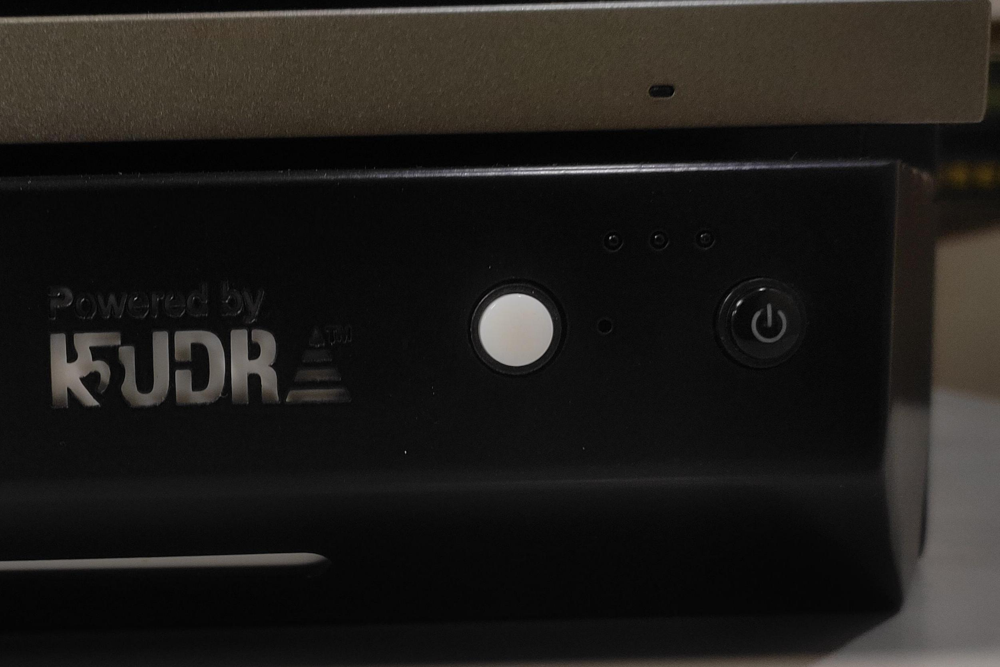
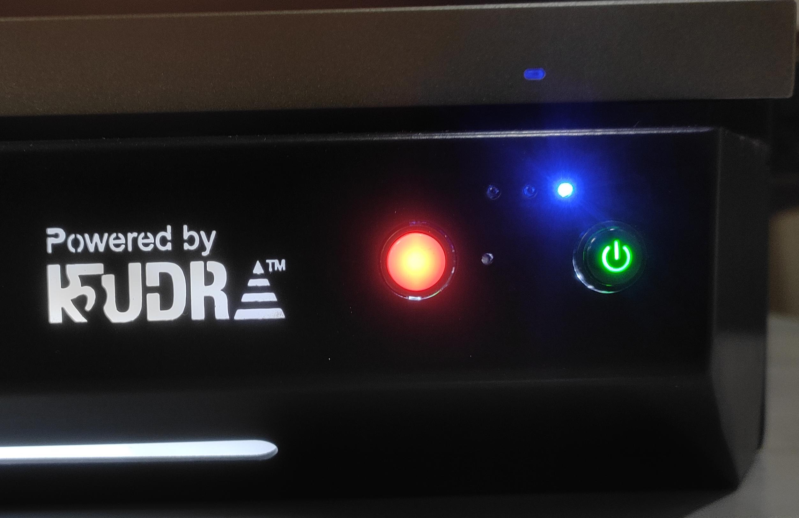
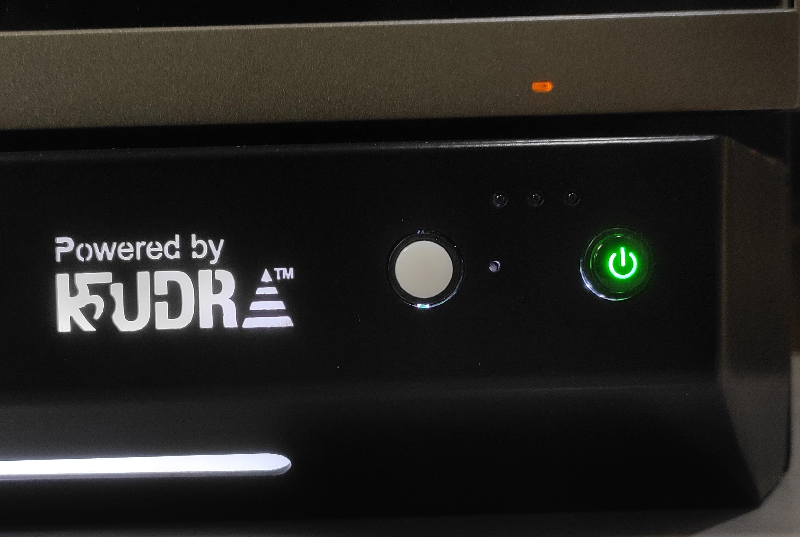
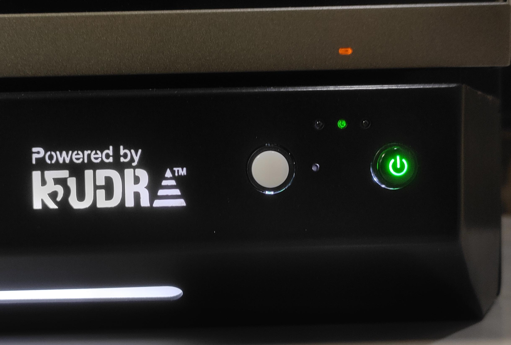
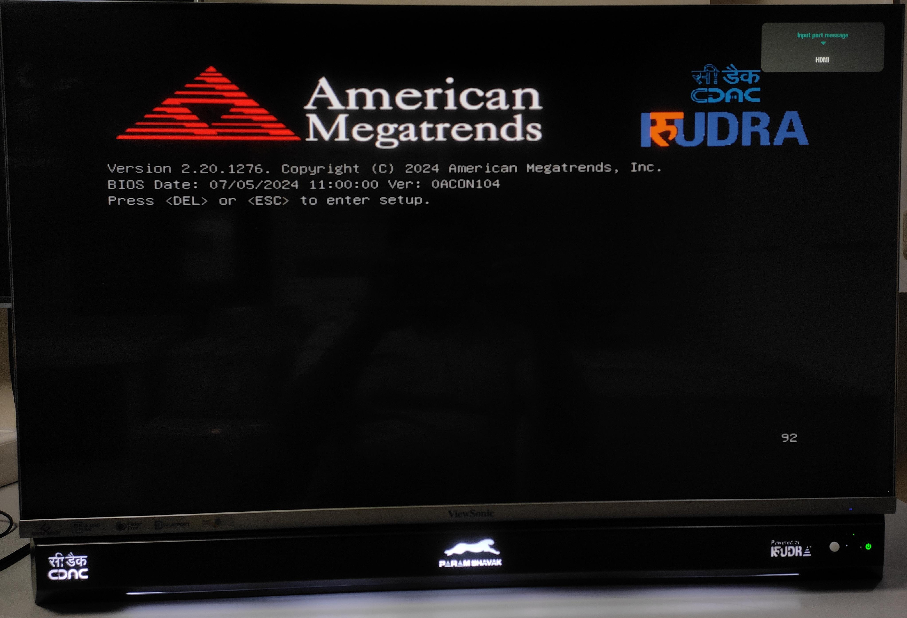
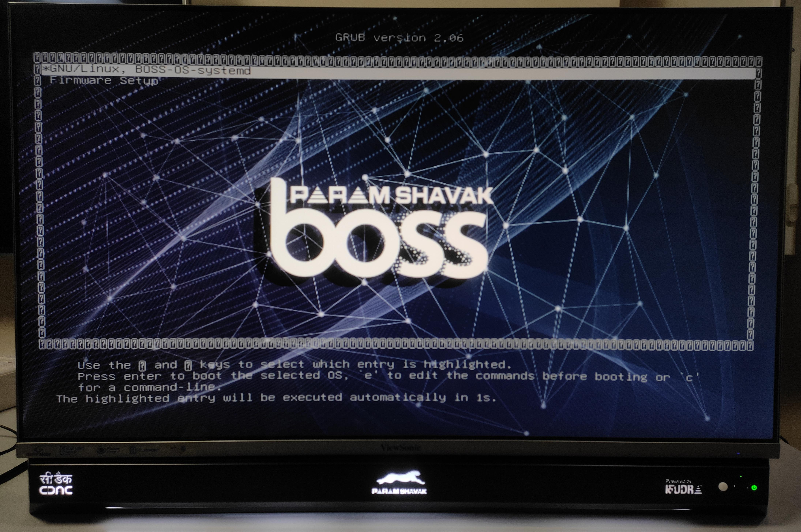
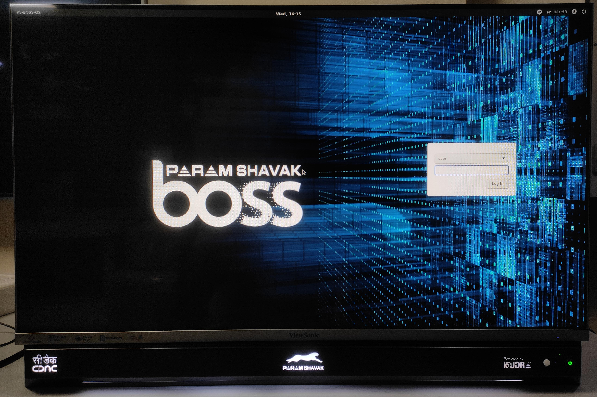

# Server Power-On and Boot Procedure

This section describes the correct procedure for powering on the server and starting the host system. The front panel includes **three status indicators and one power button** that provide information about the server's power and boot status.

Follow the procedure below to ensure the server is powered on correctly and the host boot process starts successfully.

## Front Panel Indicators and Button

The server front panel includes the following indicators and control:

|Position|Indicator / Button|Function|
|---|---|---|
|Left|Power/Status Indicator|Indicates the initial power state and changes from red to off during startup preparation.|
|Middle|Status Indicator|Turns green when the host boot process is initiated.|
|Right|BMC Board Indicator|Blue indicator showing the BMC board status.|
|Rightmost|Power Button|Used to start the host system after the initial power-on sequence.|

!!! tip "Indicator Layout"  
The **BMC indicator is located on the right side**, while the **power/status indicator is located on the left side** of the front panel. The **power button is located at the rightmost position**.

## Power-On Procedure

### 1. Connect the Power Supply

Connect the supplied power cable to the server's power socket and then connect it to the appropriate AC power source.

Once AC power is supplied to the server, the front-panel indicators will begin their initial power-on sequence.

### 2. Wait for the Initial BMC Startup

After power is connected:

- The **left indicator turns red**.
- The **BMC indicator turns blue**.
- Do not press the power button immediately.
- Allow the BMC board to complete its initial startup sequence.

!!! warning "Wait Before Pressing the Power Button"  
Allow **at least 20 seconds** after connecting AC power before pressing the power button. Pressing the power button too early may interrupt the expected startup sequence.

### 3. Wait for the Indicators to Turn Off

After approximately **20 seconds**:

- The **blue BMC indicator turns off**.
- The **red indicator on the left turns off**.

The system is now ready for the host power-on operation.

### 4. Press the Power Button

Once the blue and red indicators have turned off, press the **power button located at the rightmost position** on the front panel.

The power button indicator turns **green**, indicating that the host system power-on sequence has started.

### 5. BIOS and Operating System Boot

During the host boot process:

1. The server performs the initial hardware and firmware startup.
2. The **BIOS** screen appears.
3. The **GRUB bootloader** starts.
4. GRUB loads the configured operating system.
5. The operating system boots normally.

Allow the boot process to complete without interrupting power to the server.

### image 1

### image 2

### image 3

!!! success "Server Power-On Complete"  
The server is successfully powered on when the host boot process progresses through **BIOS → GRUB → Operating System** and the operating system is fully booted.